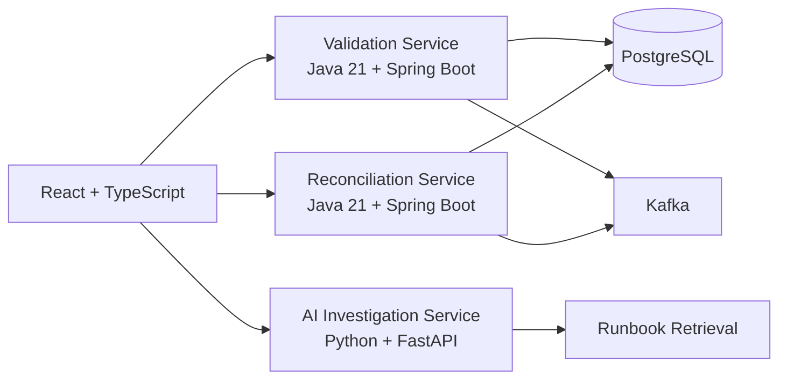

# Enterprise AI Operations Platform

A production-style portfolio project combining **Java 21 / Spring Boot microservices**, **Python / FastAPI AI services**, **React / TypeScript**, **Kafka**, **PostgreSQL**, **Docker**, **Kubernetes**, and **CI/CD**.

## Architecture



## Resume coverage

- Java 21, Spring Boot 3, REST APIs, Microservices
- Kafka, event-driven architecture
- PostgreSQL, JPA
- Python, FastAPI
- React, TypeScript
- RAG-style retrieval and AI investigation
- Docker, Kubernetes
- GitHub Actions CI/CD
- Testing and production health checks

## Services

| Service | Port | Purpose |
|---|---:|---|
| validation-service | 8081 | Validates operational records and publishes Kafka events |
| reconciliation-service | 8082 | Compares source/target datasets |
| ai-service | 8000 | AI-assisted exception investigation |
| frontend | 5173 | React operations dashboard |

## Run

```bash
cp .env.example .env
docker compose up --build
```

Then open http://localhost:5173.

## Interview talking points

This repo gives you real examples for:
- Spring Boot microservice design
- REST API contracts
- Kafka and event-driven architecture
- PostgreSQL/JPA
- Java/Python service boundaries
- React/API integration
- AI agent and RAG patterns
- Docker/Kubernetes
- CI/CD
- system design and trade-offs
